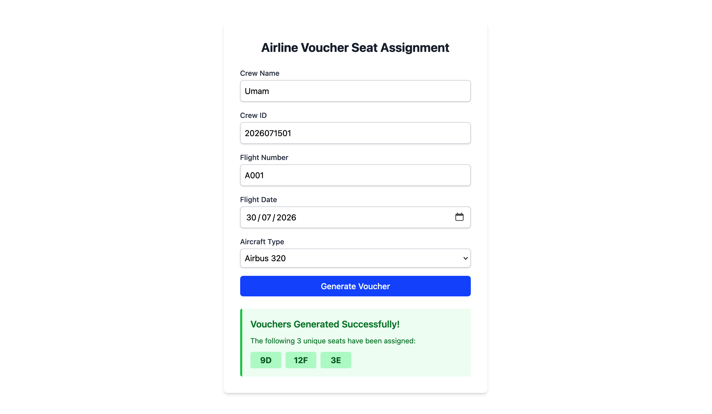

# Airline Voucher Seat Assignment Application

A full-stack web application built as a technical assessment for assigning airline voucher seats.

The application randomly selects **three unique, non-repeating seat numbers** based on the selected aircraft configuration, ensuring no duplicate seat assignments.

## Demo

<p align="center">
    
</p>

---

## Features

- Generate 3 random voucher seats
- No duplicate seat assignments
- Support multiple aircraft configurations
- Responsive user interface
- RESTful API using Laravel
- SQLite database
- Automated backend tests

---

## Tech Stack

### Frontend

- React
- Vite
- Axios

### Backend

- Laravel
- PHP 8.2+
- SQLite
- Pest

---

## Project Structure

```
project/
├── frontend/ 
├── backend/
```

---

## Prerequisites

- PHP 8.2+
- Composer
- Node.js 18+
- npm
- SQLite

---

## Installation

### Clone repository

```bash
git clone https://github.com/umem1125/Technical-Assessment-Airline-Voucher-Seat-Assignment-Application.git

cd Technical-Assessment-Airline-Voucher-Seat-Assignment-Application
```

---

## Backend Setup

```bash
cd backend

composer install

cp .env.example .env

php artisan key:generate

php artisan migrate

php artisan serve
```

Backend will run at

```
http://127.0.0.1:8000
```

---

## Frontend Setup

Open another terminal

```bash
cd frontend

npm install

npm run dev
```

Frontend will run at

```
http://localhost:5173
```

---

## Running Tests

```bash
cd backend

php artisan test
```

---

## Author

**Chaerul Umam**

GitHub:
https://github.com/umem1125

LinkedIn:
https://linkedin.com/in/chaerulumamli
